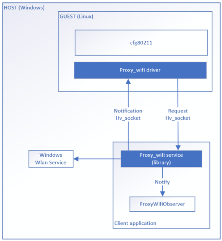
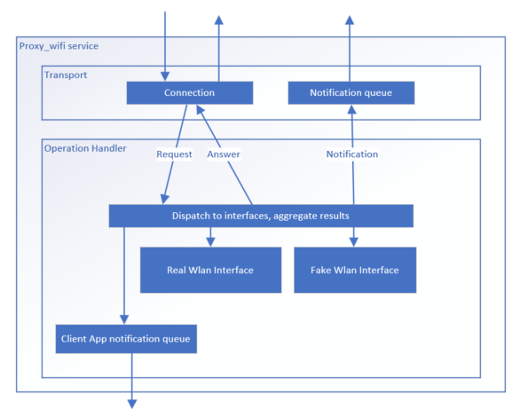

# Proxy_wifi

This project enables proxying the Wi-Fi functionnality from a Windows host machine to a VM.

It allows the VM to:
- schedule scans and access the Wi-Fi networks visible by the host
- request connections and disconnections to WPA2PSK and Open networks that will be honored by the host
- request connections to any Wi-Fi network the host is currently connected to ("connection mirroring")
- be notified in case of disconnection and signal quality changes

Networks can be also emulated by proxy_wifi, letting a VM connect to a fake Wi-Fi network.

## VM driver

This repository contains only the Windows host component. A driver must run on the VM and communicate with the host component.
Such a driver has currently been implemented from Linux only, under the name of `proxy_wifi`.

## Building

Requirements:

* cmake >= 3.20 (`choco install -u cmake`)
* [Windows SDK 19041+](https://developer.microsoft.com/en-us/windows/downloads/windows-10-sdk/)
* [Build Tools for Visual Studio 2019+](https://visualstudio.microsoft.com/downloads/#build-tools-for-visual-studio-2019)

The project generates a MSBuild project and solution for each target. These can be used directly by MSBuild tools, Microsoft Visual Studio, or with CMake directly. There are two targets defined:

1) proxy-wifi: This is a static library containing the core logic.
2) proxy-wifi-cmdline: This is a commandline utility allowing to test the proxy_wifi for basic scenarios.

### Step 1: Configure the project

In the project root:

```Shell
md build && cd build
cmake ..
```

Note that the build type is set to `DEBUG` by default. Make sure to set the `CMAKE_BUILD_TYPE` variable appropriately for the desired build flavor. For example, to create a release configuration:

```Shell
cmake -DCMAKE_BUILD_TYPE=RelWithDebInfo ..
```

### Step 2: Build the project

#### With CMake

```Shell
cmake --build ..
```

#### With Visual Studio

Open `proxy-wifi.sln` which contains a project for each build target:

* `proxy-wifi`
* `proxy-wifi-cmdline`
* `ALL_BUILD`
* `INSTALL`

#### With Visual Studio Build Tools

Point `msbuild.exe` to the project to build:

```Shell
msbuild.exe proxy-wifi.vcxproj
```

### Step 3: Run unit tests

#### Using the test executable

```Shell
.\test\Debug\proxy-wifi-test.exe
```

#### With CTest

```Shell
ctest -T test
```

## Basic usage

The public interface of Proxy_wifi is present in [`ProxyWifiService.hpp`](include/ProxyWifi/ProxyWifiService.hpp). It lets client build a `ProxyWifiService` object through the function `BuildProxyWifiService`.
This functions allows to configure the transport layer and to register to Proxy_wifi notifications.

You can additionnaly setup a logger to chose where logs will be output.

```cpp
    // Tell the ProxyWifiService to output logs to a tracelogging provider
    Log::AddLogger(std::make_unique<Log::TraceLoggingLogger>());

    class MyObserver: public ProxyWifiObserver
    {
        void OnGuestConnectionRequest(OperationType type, const DOT11_SSID& ssid) noexcept override
        {
            std::cout << "The guest requested a connection" << std::endl;
        }
    };

    // Must be kept alive until the proxy is destroyed
    auto observer = MyObserver{};

    // Callback providing a list of networks that will be simulated by the Wi-Fi proxy
    auto provideFakeNetworks = [this]() -> std::vector<WifiNetworkInfo> { return {}; /* Return simulated network SSID + BSSID */ };

    auto wifiProxy = BuildProxyWifiService(
        ProxyWifiHyperVSettings{vmId},
        std::move(provideFakeNetworks),
        &observer);
    wifiProxy->Start();
```

## Architecture overview

Proxy_wifi is constituted of a service component (proxy_wifi service) meant to
run on a Windows host, and a driver component (proxy_wifi driver) meant to run
on a guest virtual machine. This repository contains the implementation of
proxy_wifi service for Windows. Currently, an implementation of proxy_wifi
driver exists only for Linux.



Proxy_wifi driver role is to intercept Wi-Fi control path related operations
from the guest and forward them to proxy_wifi service. Communication between
proxy_wifi driver and proxy_wifi service relies on two Hyper-V sockets (hvsockets): one allows
proxy_wifi driver to make a request to proxy_wifi service and wait for the
answer ; the other one allows proxy_wifi service to send spontaneous
notifications to proxy_wifi driver.

Proxy_wifi service is a library, its code will be running inside your
application process.  It uses the Windows Wlan API to perform any Wi-Fi
realated operation in the host. It can also emulate operations on fake
networks if requested by the client application.

Proxy_wifi service present an observer interface (`ProxyWifiObserver`) that
client application should implement to be notified when an operation is request
by the guest or a network change is detected on the host. It is expected the
client application will monitor these events to synchronize proxy_wifi with
other component virtualizing the data path or L3 layer properties.

## Proxy_wifi service architecture



Proxy_wifi is composed of two main layers: the transport
([Transport.hpp](lib/Transport.hpp)) and the operation handler
([OperationHandler.hpp](lib/OperationHandler.hpp)).

The concrete implementations of `ProxyWifiService` initialize these two layers
and expose a clean API to client applications.

The transport is responsible for communications with the proxy_wifi driver on
the guest VM. The operation handler is responsible of honoring these requests
and notifying the client application.

### Transport layer

The transport layer communicate with the guest proxy_wifi driver over two channels:

- a request channel: it handles commands from the proxy_wifi driver and their
  responses, such as connection or scan requests.
- a notification channel: it handles spontaneous notification from the host, such
  as network disconnection, signal quality changes and scanned bss updates.

The transport layers deals with `Message` ([Messages.hpp](lib/Messages.hpp)) and isn't aware of their content or structure beside the header + body layout.

Messages coming over the request channel are handled as synchronous transactions: once a request is accepted in `Transport::AcceptConnections` ([Transport.hpp](lib/Transport.hpp)), no other request will be handled until the transaction is completed by sending an answer.

On the other hand, messages sent over the notification channel are handled in a fire and forget fashion: the transport send notification asynchronously through a queue and doesn't expect any answer from proxy_wifi driver.

Two implementations of the transport layers are available: over HV sockets or over TCP sockets.
Only the HV socket implementation is supported by the current proxy_wifi driver on the guest. The TCP implementation is mostly available for testing.

### The operation handler

The operation handler manage a list of interfaces. It dispatches request
received by the transport and aggregate results produced by each interfaces. It
is also responsible to send notification both to proxy_wifi driver on the guest
and to the client application.

The operation handler uses typed requests and responses, parsed from the
`Messages` used by the transport ([`Messages.hpp`](lib/Messages.hpp)).
Interface management, requests processing and notifications targetting the
guest are serialized through a work queue (`m_serializedRunner`).

Another work queue (`m_clientNotificationQueue`) serialize notifications sent
to the client application.

The operation handler maintain a list of `WlanInterface`
([WlanInterface.hpp](lib/WlanInterface.hpp)) that represent actual Wi-Fi
interfaces on the host or fake interfaces to simulate networks.

Requests are dispatched to interfaces, either serialized or running
concurrently depending on the operation type.

In particular:

- "Scan" operations are ran on all available interfaces concurrently, and the scan results are aggregated
- "Connect" operations are ran successively on each interface until one succeeds
- "Disconnect" operations target only the previously connected interface

Each interface handles the command depending on its concrete implementation,
using simulated data or fowarding the operation through the host Wlan API.

#### Simulated interface

If the client application provide a `FakeNetworkProvider` callback when instancitating proxy_wifi service, a simulated (or "fake" interface will be created). It allows to simulate Wi-Fi networks in the guest.

At any point in time, the simulated interface consider that all networks returned by the `FakeNetworkProvider` callback are visible and connected. Connection and disconnection request to these networks will always succeed as long as they are returned by the callback and they will correspond to no-op.

The simulated interface is always considered first when dispatching operations, effectively giving it priority.

#### Real interfaces

Real interfaces correspond to the actual wlan STA interfaces on the host.
Proxy_wifi service add and remove these interfaces dynamically following their
state on the system.

Operation on real interfaces are implemented through calls to the Win32 Wlan
APIs. However, the operations requested from the guest are not mapped directly
to the equivalent host operation, since those operation can be time-consuming
or impact the host network connectivity.

In particular:

- a host interface will be connected at the guest request only if no other
  interface was already connected to the requested network.
- a host interface will be disconnected at the guest request only if it was
  connected because of the guest.
- a host interface will always schedule a scan on the host at the guest
  request, but will return cached results immediately, unless a previous scan
  request still hasn't completed. Whenever a scan completes on the host, the
  visible network are spontaneously sent to the guest to limit the number of
  scan necessary.

## Capabilities and limitations

Proxy_wifi currently fully support connections from the guest to WPA2PSK and Open networks only.
This is due to Linux allowing only these two authentication algorithms to be offloaded to the driver.

In addition, Proxy_wifi allows the guest VM to "mirror" a connection on the host, for any network type.
Since the host is already connected, no authentication is actually needed, which make the operation straighforward.
However, in order to allow this, the authentication algorithm for any non-supported network is faked in scan results and showed as WPA2-PSK.

## Contributing

This project welcomes contributions and suggestions.  Most contributions require you to agree to a
Contributor License Agreement (CLA) declaring that you have the right to, and actually do, grant us
the rights to use your contribution. For details, visit https://cla.opensource.microsoft.com.

When you submit a pull request, a CLA bot will automatically determine whether you need to provide
a CLA and decorate the PR appropriately (e.g., status check, comment). Simply follow the instructions
provided by the bot. You will only need to do this once across all repos using our CLA.

This project has adopted the [Microsoft Open Source Code of Conduct](https://opensource.microsoft.com/codeofconduct/).
For more information see the [Code of Conduct FAQ](https://opensource.microsoft.com/codeofconduct/faq/) or
contact [opencode@microsoft.com](mailto:opencode@microsoft.com) with any additional questions or comments.

## Data Collection

The software may collect information about you and your use of the software and send it to Microsoft. Microsoft may use this information to provide services and improve our products and services. You may turn off the telemetry by setting the CMake cache variable `MICROSOFT_TELEMETRY` to `OFF`:

```Shell
cmake -DMICROSOFT_TELEMETRY=OFF ..
```

There are also some features in the software that may enable you and Microsoft to collect data from users of your applications. If you use these features, you must comply with applicable law, including providing appropriate notices to users of your applications together with a copy of Microsoft’s privacy statement. Our privacy statement is located at <https://go.microsoft.com/fwlink/?LinkID=824704>. You can learn more about data collection and use in the help documentation and our privacy statement. Your use of the software operates as your consent to these practices.

## Trademarks

This project may contain trademarks or logos for projects, products, or services. Authorized use of Microsoft 
trademarks or logos is subject to and must follow 
[Microsoft's Trademark & Brand Guidelines](https://www.microsoft.com/en-us/legal/intellectualproperty/trademarks/usage/general).
Use of Microsoft trademarks or logos in modified versions of this project must not cause confusion or imply Microsoft sponsorship.
Any use of third-party trademarks or logos are subject to those third-party's policies.